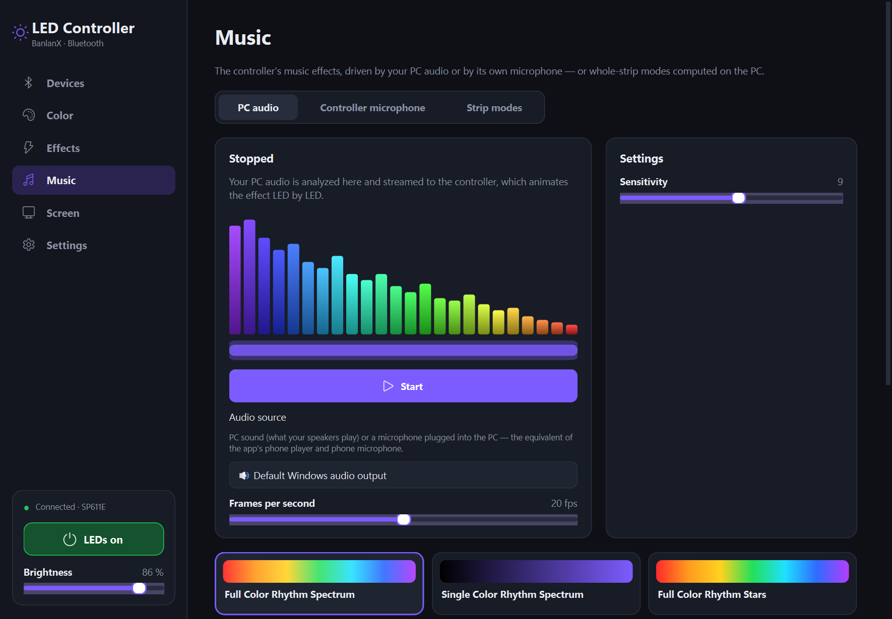
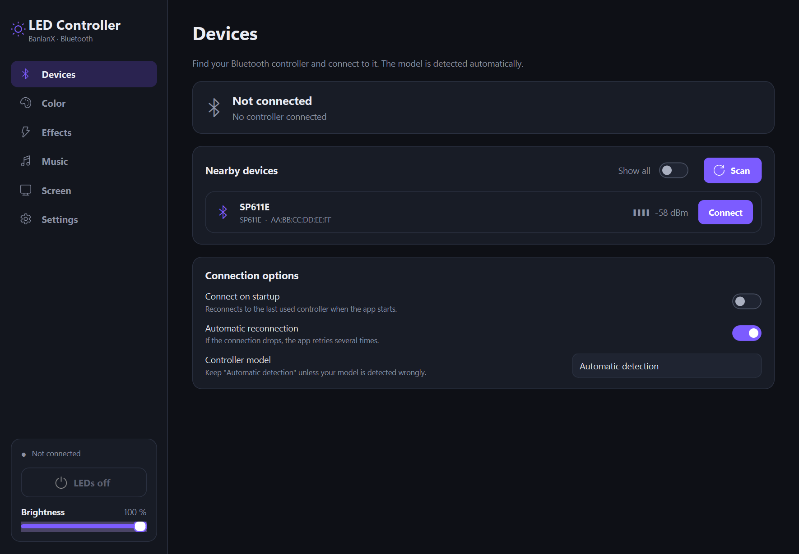
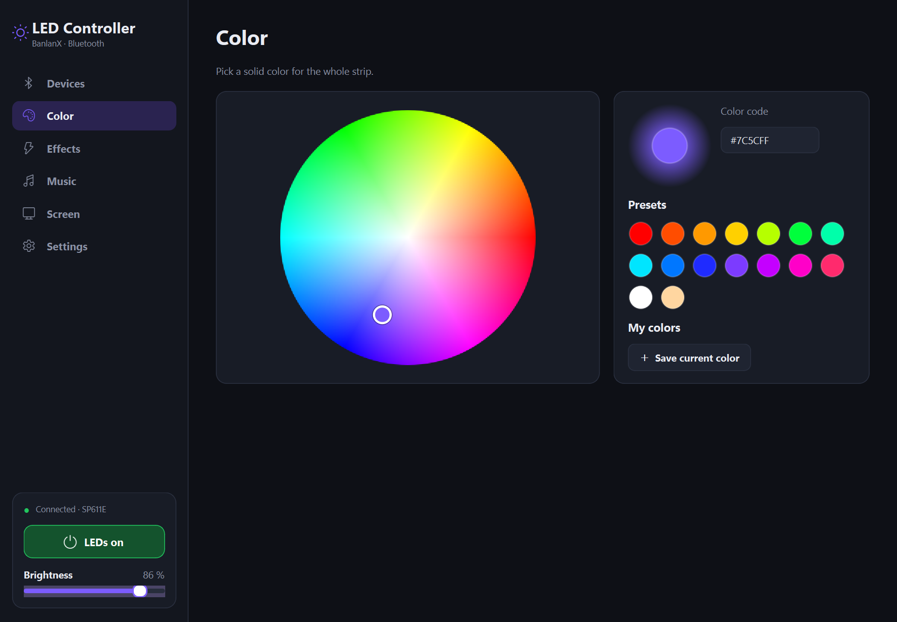
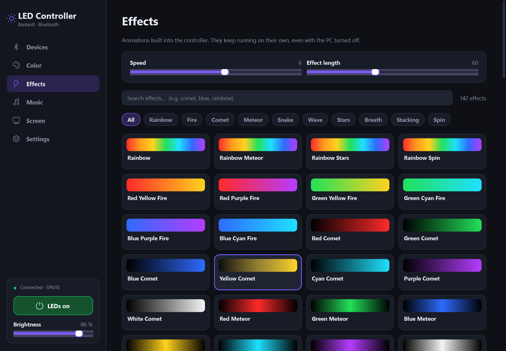
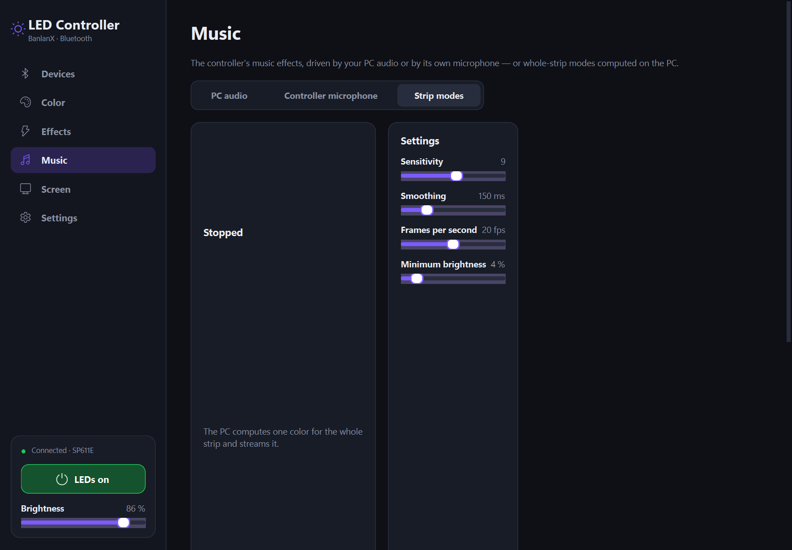
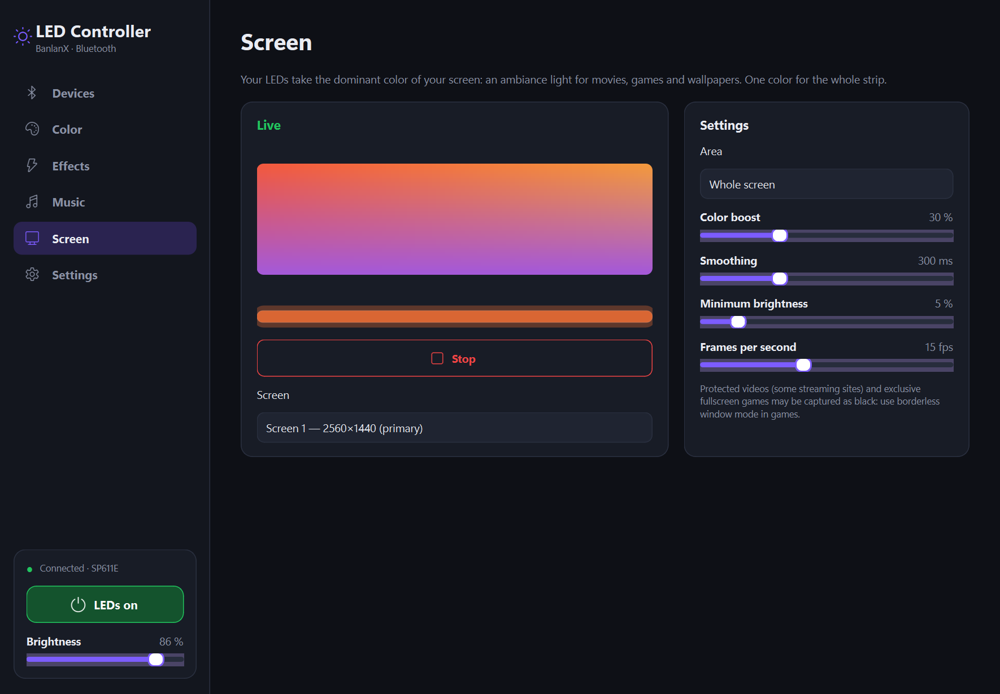
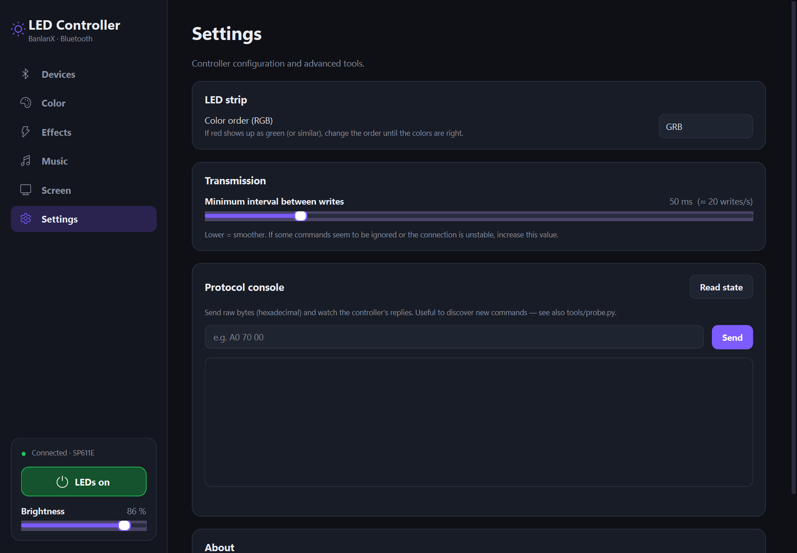

# LED Controller

A modern desktop app to control **BanlanX** Bluetooth LED controllers (SP611E, SP617E, SP613E…, normally driven
by the *BanlanX* mobile app) from your PC: solid colors, the 142 built-in effects, the 18 built-in music effects
— driven by your **PC audio** — and more.



> Unofficial project, not affiliated with BanlanX / SPLED. The protocol was reverse-engineered for
> interoperability.

## Features

- **Connect in one click** — automatic scan and model detection, disconnect button, automatic reconnection
  when the link drops, optional connection on startup.
- **Opens where you left off** — on connection the app shows the tab matching what the controller is playing,
  with its current settings (it reads the controller's real state).
- **Colors** — color wheel, hex code, presets and saved colors, white channel on RGBW models.
- **142 effects** — with their official names, search, category filters, speed and effect length.
- **Music, like the mobile app**
  - **PC audio**: the controller's 18 music effects (Full Color Rhythm Spectrum, Rhythm Stars, VuMeter…)
    animate each LED, driven by what your PC plays or by a microphone plugged into the PC — the equivalent of
    the app's phone player / phone microphone modes.
  - **Controller microphone**: the same effects, listening to the room with the controller's own microphone.
  - Each effect shows the settings it supports, like in the app: sensitivity (1–16), effect length, color.
  - **Strip modes**: 10 extra modes computed on the PC (Spectrum, Pulse, Beat Flash, Dancing Rainbow, Bass,
    VU Meter, Fire, Strobe…), with sensitivity, smoothing and frame rate.
- **Screen ambiance** — the strip takes the dominant color of your screen (whole screen or edges only, like an
  Ambilight), with color boost, smoothing and minimum brightness: great for movies and games.
- **Power and brightness** always at hand in the sidebar.
- **Settings** — RGB wiring order, Bluetooth write rate, and a protocol console to send raw bytes.

## Screenshots

| Devices | Color |
|---|---|
|  |  |
| **Effects** | **Strip modes** |
|  |  |
| **Screen ambiance** | **Settings** |
|  |  |

## Download

Ready-to-run builds are attached to each [release](../../releases/latest):

| System | File | Notes |
|---|---|---|
| Windows 10/11 | `LED-Controller-windows-x64.zip` | unzip and run `LED-Controller.exe` |
| macOS (Apple Silicon) | `LED-Controller-macos-arm64.zip` | unsigned: right-click the app → *Open* the first time |
| Linux x64 | `LED-Controller-linux-x64.tar.gz` | needs BlueZ; run `./led-controller` |

The PC audio features (PC sound and PC microphone as music source) currently work on **Windows only**: they
use WASAPI. On macOS and Linux everything else works, including the music effects that listen to the
controller's microphone.

The screen ambiance works on Windows, macOS (grant *Screen Recording* permission) and Linux under X11
(Wayland sessions are not supported by the capture library).

## Run from source

Requirements: a PC with Bluetooth Low Energy and [uv](https://docs.astral.sh/uv/getting-started/installation/).
uv installs the right Python version and every dependency for you.

```bash
git clone https://github.com/<your-account>/LED-controller.git
cd LED-controller
uv run led-controller
```

`uv run led-controller-gui` starts the app without a console window.

> The controller accepts a single Bluetooth connection: close the mobile app (or turn off the phone's
> Bluetooth) before connecting from the PC.

## Supported controllers

| Family | Models | Status |
|---|---|---|
| BanlanX v2 (SPI, `A0 …` commands) | **SP611E**, SP617E (RGBW), SP620E, SP621E | SP611E tested on real hardware |
| BanlanX v3 (PWM) | SP613E, SP614E (RGBW), SP623E, SP624E | implemented from the UniLED protocol, untested |

Models are recognized from their Bluetooth advertisement. An unknown controller that looks like a BanlanX
device is probed on connection (the app tries each protocol until one answers), and the model can be forced in
*Devices*. The PC audio music mode needs a model with a microphone from the v2 family.

## Usage tips

- **Music → PC audio**: play something on the PC, pick an effect: it starts immediately. *Sensitivity* is the
  controller's own (1–16). Use *Audio source* to pick the PC sound or a microphone.
- **Using a PC microphone**: if every microphone fails to open, Windows is blocking microphone access for desktop
  apps — turn on *Settings → Privacy & security → Microphone → Let desktop apps access your microphone*.
- **Wrong colors** (red shows as green…): change *Settings → Color order*.

## How it works

### Protocol

Commands are written to the GATT characteristic `ffe1` as `A0 <opcode> <length> <data…>`
(e.g. `A0 63 01 BE` = solid color, `A0 69 04 R G B L` = color + level). `A0 70 00` asks for the state, which
comes back in several notifications starting with `SC`. The base protocol comes from the
[UniLED](https://github.com/monty68/uniled) project.

The **phone microphone music mode** was not documented anywhere. It was found by testing on an SP611E: with the
audio input set to *Player* (`A0 6C 01 01`), the controller waits for audio data, sent as
`A0 6D <n> <levels…>` (up to 16 levels, 0–255). Frames longer than one 20-byte BLE packet hang the controller.

### Timing

Measured on an SP611E:

- the Bluetooth link carries about **20 writes per second**. Writing faster only builds a backlog in the Windows
  Bluetooth stack, and every later command then arrives seconds late;
- a command that arrives less than ~100 ms after another one can be silently ignored.

The app therefore sends through a **coalescing queue** (a pending music frame or slider value is replaced by
the newest one), paces writes at ~20/s, leaves 120 ms after one-off commands, and reads the state back after an
effect or audio input change to resend anything the controller ignored.

### Screen ambiance

The screen is captured with DXGI Desktop Duplication on Windows ([dxcam](https://github.com/ra1nty/DXcam): the
image is read from the GPU and nothing is copied while the screen does not change, about 1 ms of CPU per frame)
and [mss](https://github.com/BoboTiG/python-mss) elsewhere. The image is subsampled to ~96 columns; near-black
pixels are ignored and bright, saturated pixels weigh more, so a colorful scene gives a vivid color instead of
a dull average. The result is smoothed and streamed like the music frames.

### Audio

Capture uses WASAPI (loopback for the PC sound) with a callback and a ring buffer, so the analysis always runs on
the latest samples. An FFT splits the sound into bands, an adaptive floor/peak normalizes the dynamics whatever
the volume, envelopes give fast attacks and smooth releases, and beats are detected on the bass.

## Known issues

- After many effect changes, an SP611E can start rendering animated effects with garbled colors (each LED a
  different color) while solid colors stay correct. Its settings are unchanged and only unplugging the
  controller clears it: this is a controller firmware issue.

## Reverse-engineering tools

```bash
uv run tools/probe.py scan                          # nearby controllers + advertisement data
uv run tools/probe.py info <MAC>                    # GATT services + decoded state
uv run tools/probe.py send <MAC> "A0 63 01 05"      # send raw bytes
uv run tools/probe.py watch <MAC>                   # live notifications (IR remote, button…)
uv run tools/probe.py reset <MAC>                   # back to solid white, built-in microphone
uv run tools/probe.py spectrum <MAC>                # explore the A0 6D audio feed format
uv run tools/probe.py effects <MAC> --interactive --unknown-only    # hunt for hidden effects by eye
uv run tools/probe.py opcodes <MAC> --i-understand  # brute-force unknown opcodes (careful)
uv run tools/btsnoop.py btsnoop_hci.log --stats     # decode an Android Bluetooth capture
```

> ⚠ The brute-force commands send unknown data to the controller. Keep the brightness low, and expect to
> unplug the controller if it hangs.

`btsnoop.py` is the most reliable way to learn a command used by the mobile app: turn on the *Bluetooth HCI
snoop log* in the Android developer options, use the app, fetch the log with `adb bugreport`, then decode it.

## Development

```bash
uv run pytest                 # tests
uv run tools/screenshots.py   # regenerate the README screenshots (simulated controller)
uv run --group build pyinstaller packaging/led-controller.spec --noconfirm   # build the app into dist/
```

### Releasing

Every push builds the app for Windows, macOS and Linux (GitHub Actions, `.github/workflows/build.yml`); the
builds can be downloaded from the run's *Artifacts*. Pushing a version tag publishes a release with them:

```bash
git tag v1.0.0
git push origin v1.0.0
```

A tag with a suffix (e.g. `v1.1.0-beta.1`) is published as a pre-release.

```
src/ledctl/
  protocol/   commands, effect catalogue, state decoding (BanlanX v2 / v3), model detection
  ble/        bleak asyncio loop: scanning, connection, coalescing write queue
  audio/      WASAPI capture, FFT and beat analysis, visualizers, real-time engine
  ui/         PySide6 interface (theme, widgets, pages)
  screen.py   screen capture and dominant color for the screen ambiance
  session.py  application logic: turns UI actions into controller commands
tools/        BLE probe / brute-forcer, btsnoop decoder, screenshot generator
```

Settings are stored in `%APPDATA%\LED-Controller\settings.json` (`~/.config/LED-Controller` elsewhere).

## Credits

- [UniLED](https://github.com/monty68/uniled) by monty68 — the BanlanX protocol and effect lists this project
  builds on.
- [bleak](https://github.com/hbldh/bleak), [PySide6](https://doc.qt.io/qtforpython-6/),
  [PyAudioWPatch](https://github.com/s0d3s/PyAudioWPatch), [DXcam](https://github.com/ra1nty/DXcam),
  [mss](https://github.com/BoboTiG/python-mss) and [NumPy](https://numpy.org/).
